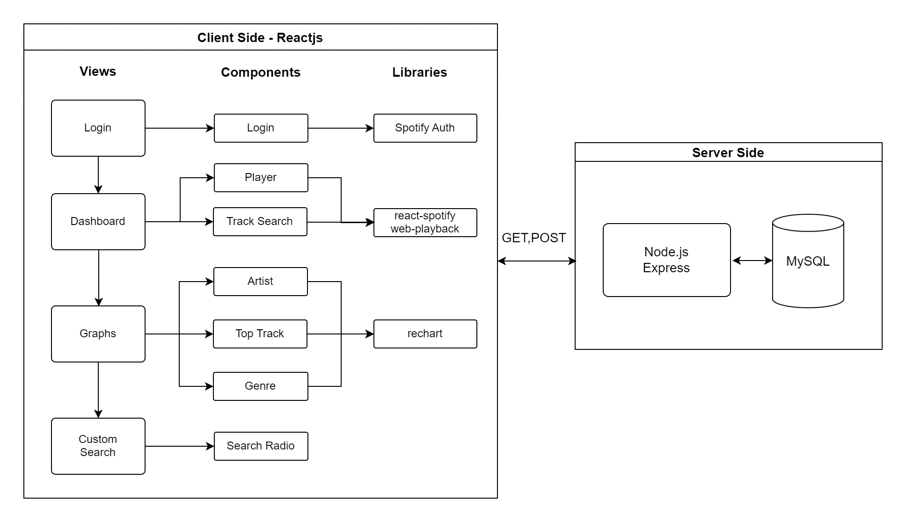

# Spotify-With-Data

## A Spotify player application that shows you data on your music preferences, and allows custom song recommendation based on mood

[Link to the Site](https://mhcheng-spotifyapp.netlify.app/)

The application makes use of Spotify auth and contains music playing functionality. In addition, it presents a visualization of the user's song preference as various graphs, and includes a feature that can select songs based on the user's mood.

## Demo:

## Features
A functional web player with search function implemented.

* User's favorite artist

* Duration of user's most listened songs

* Preference of audio features in a song, such as danceability and liveness

* User can search for a song based on the mood. For instance a user can search for a slow groovy song suitable for dancing.

## Technical Architecture 

Frontend: 
 - React.js
 - Hosted on Netlify

Backend:
 - Node.js/Express.js
 - Hosted on Heroku

Database:
 - MySQL

Diagram:

Spotify User Authorization Flow:

[Reference: https://developer.spotify.com/documentation/general/guides/authorization/code-flow/]

## Libraries Used
* [spotify-web-api-node](https://www.npmjs.com/package/spotify-web-api-node)
* [react-spotify-web-playback](https://www.npmjs.com/package/react-spotify-web-playback)
* recharts

### Run the App Locally

Spotify account is required to run this app as it uses Spotify's Developer Api

Enter frontend directory from root directory

`cd front-end`

Download requirements

`npm install`

Run

`npm start`

Enter server directory from root directory

`cd server`

Download requirements

`npm install`

Run

`node server.js`

Update the env variables with your Spotify Client ID and Secret at [Spotify For Developer](https://developer.spotify.com/)
